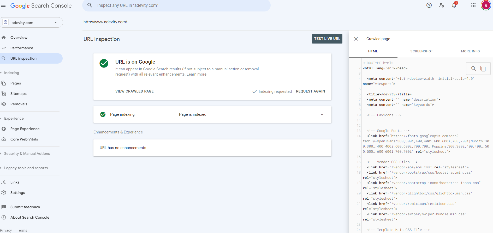

# Technical Documentation

**If you are viewing this directly from VSCode Install the `Markdown Preview Enchanced extension`. After that rght click on the file and click Markdown Preview Enchanced option.**


## Package.json
```
"scripts": {
    "start": "node app.js",
    "compile:sass": "node-sass sass/main.scss public/style.css -w",
    "test": "set PORT=3000&&jest --runInBand",
    "lint": "eslint --ext .js --verbose true --ignore-path .gitignore ."
},
```
`runInBand` is needed to run the tests sequentially. Until I find out a way to run the puppeteer tests in parallel. Without them interfering with each other.

## What environment variables are needed?
#### First create a .env file in the root directory.
#### Then add the following variables to it.
```.env
session_secret=SOMESECRET

db_dev_user= sth
db_dev_password = sth
db_dev_server = sth
db_dev_database = sth
db_dev_instanceName= sth


db_prod_user= sth
db_prod_password = sth
db_prod_server = sth
db_prod_database = sth
db_prod_instanceName= sth

PORT=80
dbState=dev
env = TESTING


test_webadmin_username=sth
test_webadmin_password=sth


AMAZON_ACCESS_KEY_ID=sth
AMAZON_SECRET_ACCESS_KEY=sth
AMAZON_BUCKET_NAME=sth

DEV_AMAZON_ACCESS_KEY_ID=sth
DEV_AMAZON_SECRET_ACCESS_KEY=sth
DEV_AMAZON_BUCKET_NAME=sth

updateSchema='NO'
```

`updateSchema='NO'` is used to update the database schema. If you want to update the schema set it to `YES` and run the server. After the schema is updated set it back to `NO`. I am doing it this way because we do not want to accidentally update the schema when switching between branches. This will also act as a final safeguard if you accidentally upload code to production server. It won't update the schema and it will be easier to revert the code changes then to revert the schema changes.

## Formatting guidelines ESLINT
``` json
{
    "env": {
        "browser": true,
        "commonjs": true,
        "es2021": true,
        "jest/globals": true
    },
    "extends": [
        "airbnb-base","plugin:jest/recommended"
    ],
    "parserOptions": {
    },
    "rules": {
        // Functions and classes are hoisted, so it's not necessary to define them before using them
        // But as we get things cleaned up, we can turn this rule back on to be up to the Airbnb style guide
        "no-use-before-define": ["error", {"functions": false, "classes": false}],
        "no-console": "off",
        "no-unused-vars": ["error", { "argsIgnorePattern": "^_" }],
        "linebreak-style": 0   // <----------
    },
    "globals": {
        // It may be worth noting that you set the global variable to true if you can assign 
        // the variable to something else and false if it shouldn't be reassigned
        "createGenericMessage":false,
        "$":false,
        "glbObj":false,
        "moment":false,
        "setDateToTodaysDate":false
    }
}
```

In addition to setting the above file you also need to create a `.settings.json` file in vscode and add the following code to it.
``` json
{
    "terminal.integrated.profiles.windows": {
        "PowerShell": {
          "source": "PowerShell",
          "icon": "terminal-powershell",
          "args": ["-ExecutionPolicy", "Bypass"]
        }
      },
      "terminal.integrated.defaultProfile.windows": "PowerShell",
      
      "editor.codeActionsOnSave": {
        "source.fixAll.eslint": true
      },
      "eslint.validate": ["javascript"],
}
```

`editor.codeActionsOnSave` option will try to autofix format issues when it can. If it can't it will show you the errors in the editor.

The global variables like `glbObj`, `moment` etc are used throughout the project. So I have added them to the global variables. If you are using a variable throughout the project add it to the global variables. If you are using a variable only in a single file add it to the `globals` object in the file. 

We are using the airbnb style guide. So please follow it. If you are using VSCode install the `eslint` extension. It will show you the errors in the code. If you are using a different editor you can use the `eslint` command to check for errors.

Remove error Expected linebreaks to be 'LF' but found 'CRLF' linebreak-style
Adding  `linebreak-style": ["error", "windows"]` to eslint Config worked. 


I forgot the meta tag in my header and the site info was not showing up properly. Once I added the meta tags I went to google console and requested indexing:




Docker command:

docker-compose up --build

OR

docker-compose -f docker-compose.yml -f docker-compose.dev.yml up --build

Sometimes might have to clear docker cache:
docker-compose down
docker-compose up --build


In launch.json. Click Ctrl_shift+D

Click on create `launch.json`  file
Select "Node.js" for the environment.
Modify the configuration to attach to the Node.js process running inside the Docker container. 

```
{  
"version": "0.2.0",  
"configurations": [  
{  
"type": "node",  
"request": "attach",  
"name": "Attach to Docker",  
"port": 9229,  
"address": "localhost",  
"localRoot": "${workspaceFolder}",  
"remoteRoot": "/SHITTERGAMES",  
"protocol": "inspector",  
"skipFiles": ["<node_internals>/**"]  
}  
]  
}
```

This configuration tells VSCode to attach to a Node.js process that's listening on localhost:9229. The localRoot and remoteRoot settings ensure that VSCode can correctly map source files in your workspace to their corresponding locations inside the Docker container.

In package.json nodemon should be listed as dev dependency:

    "dependencies": {
      "nodemon": "^2.0.22",


The .env file and its contents (like env=development) do not automatically set environment variables inside the Docker container unless explicitly
 used by your application or passed through Docker Compose. 
 Docker does not automatically parse .env files and set environment variables within containers based on its contents. We need to use the env_file configuration in docker-compose.yml to specify environment variables, or set them directly using the environment key in your Docker Compose service definitions


To do the Run and Debug go to "Run and Debug option" on the side bar and click on the attach to docker option

What Happens During Debugging
Starting the Docker Container: You start your Docker container using Docker Compose, which sets up the environment your application needs to run. This includes setting up volumes for live code updates, exposing ports for debugging, and running the application using nodemon with the Node.js debugger enabled (--inspect).

Enabling Debugging in Node.js: By using nodemon --inspect=0.0.0.0:9229 in your package.json or directly in your Docker configuration, you start your Node.js application in a special debug mode. This mode opens a WebSocket server on port 9229 (by default) that listens for debugging clients to connect.

Configuring VSCode: In your launch.json, you configure VSCode to attach to the debugging session. You specify the local and remote root directories to ensure VSCode can correctly map the source files in your container to the files in your local development environment. This mapping is crucial for breakpoints to work correctly.

Attaching the Debugger: When you start the debug session in VSCode, it connects to the Node.js debugging server running inside your Docker container. This connection allows VSCode to control the execution of your application, stop at breakpoints, and evaluate expressions.

Debugging: With the debugger attached, VSCode intercepts execution at specified breakpoints, allowing you to inspect the current state of the application, step through code line by line, and debug issues just as if the application were running outside of Docker.